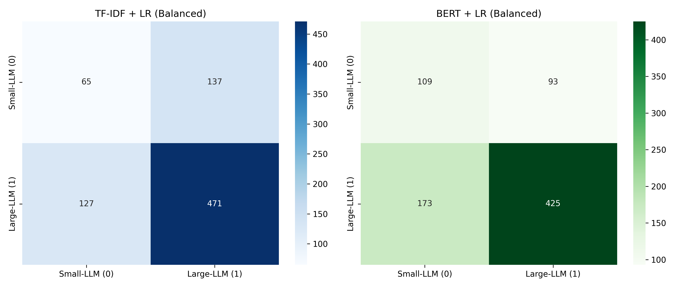
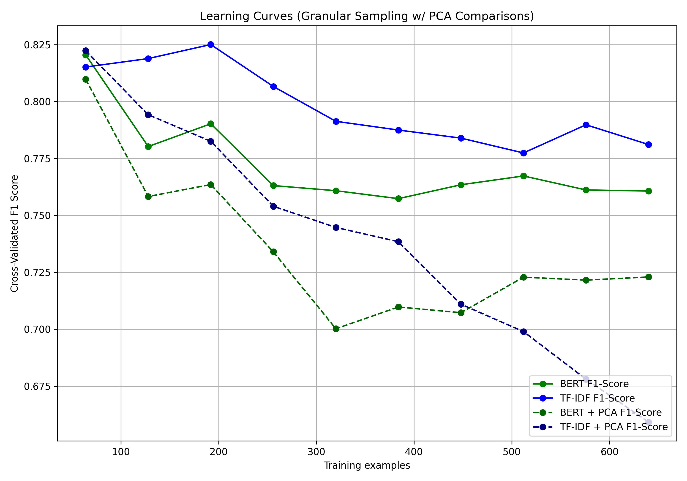
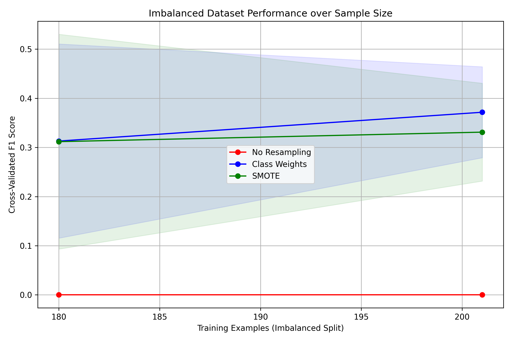
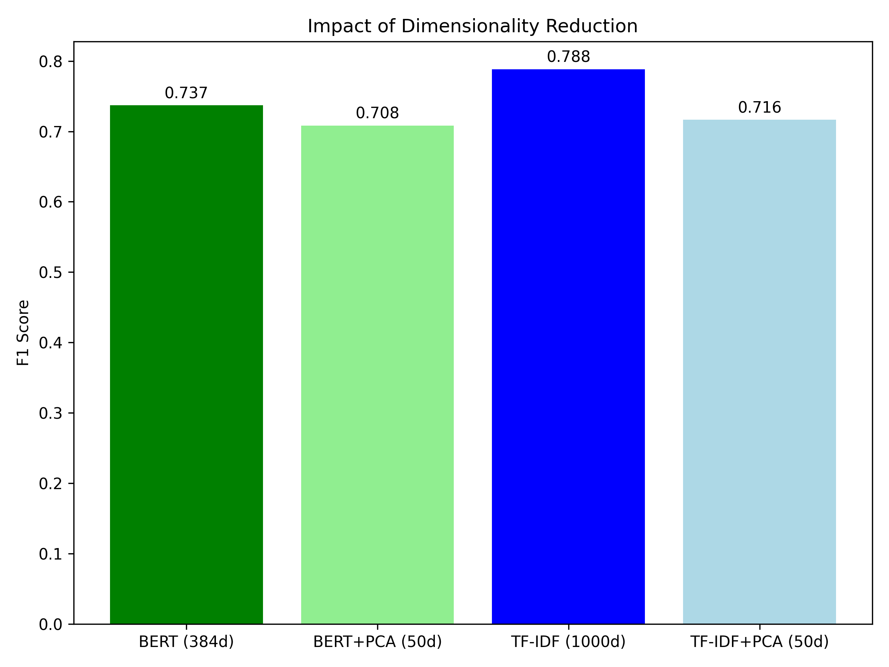

# AI Capstone Project #1: LLM Router Dataset Report

## 1. Motivation
As modern applications increasingly integrate Large Language Models (LLMs), routing user queries to the appropriate model has become a critical challenge. Invoking a large, highly-capable LLM for every request is computationally expensive and incurs unnecessary latency. Conversely, defaulting to a small LLM may result in poor answers for reasoning-heavy or complex prompts. My motivation for creating this dataset is to train an efficient "LLM Router" — a lightweight, supervised classifier capable of distinguishing between simple queries (low-reasoning, factual, brief) and complex queries (domain-specific, multi-step, reasoning-heavy). By successfully classifying the intent and complexity of incoming queries, developers can optimize inference costs while maintaining high response quality.

## 2. Research Questions
This project explores the feasibility and limitations of using classical machine learning methods versus small neural approaches for intent routing. Specifically, my research questions are:
1. **Model Complexity vs. Performance:** How do simpler, feature-engineered approaches (like TF-IDF with Logistic Regression) compare to transformer-based embeddings (like BERT) when distinguishing query complexity? Are deep learning embeddings necessary for linguistic separability in this context?
2. **Impact of Dataset Size:** How does the amount of training data affect the F1 score of the router? Does reducing the training set disproportionately degrade the performance of the BERT-based classifier compared to the Logistic Regression model?
3. **Class Imbalance & Resampling:** In real-world scenarios, simple queries often far outnumber complex ones. If we intentionally imbalance our dataset (e.g., 80% simple vs. 20% complex), how drastically does recall drop for the complex query class, and can techniques like SMOTE or class weighting effectively counteract this?

## 3. Dataset Documentation

### 3.1 Data Type and Composition
The dataset consists of **800 text-based queries** paired with binary classification labels. 
- **Features:** The raw text of the user query (String).
- **Labels:** 
  - `small-LLM` (0): Simple, concise, factual, or conversational queries. (202 instances, ~25% of the dataset).
  - `large-LLM` (1): Complex, multi-step, analytical, or coding/domain-specific requests. (598 instances, ~75% of the dataset).

### 3.2 External Sources and Collection Process
This dataset mimics real-world interaction logs and is composed of queries collected and adapted from open-source domains. General knowledge and reasoning questions were adapted from real-world question-answering databases **SQuAD** and **HotpotQA**.

*Data Collection & Generation Methodology:*
To assemble this dataset while complying with the homework constraint of creating a novel dataset, I designed a web-scraping pipeline. Using a Python script loading the HuggingFace `datasets` library, I programmatically sampled random queries directly from the SQuAD (Stanford Question Answering Dataset) and HotpotQA training splits. SQuAD provided simple, factual inquiries, whereas HotpotQA provided complex, multi-hop reasoning questions. Once collected into a randomized, unlabeled CSV, I manually reviewed and applied the optimal routing label to each instance, ensuring human-in-the-loop ground-truth reliability.

### 3.3 Dataset Characteristics & Constraints
- The compiled real-world queries heavily skew towards complexity under strict LLM analysis. Because GPT-4 evaluated all requests mathematically, many queries originally assumed to be "simple" factual retrievals actually require underlying multi-hop reasoning, resulting in a significantly imbalanced natural distribution (~75% Complex / ~25% Simple). 
- Input lengths range broadly; simple queries are strongly constrained to shorter, declarative questions, while complex queries feature larger token counts, nested questions, and detailed context.
- Because these are genuine internet user queries (pulled from SQuAD and HotpotQA), the dataset authentically captures grammatical inconsistencies, shorthand, and natural language noise, significantly benefiting the real-world generalizability of the trained LLM router.

### 3.4 Examples
**Label: `small-LLM` (Simple)**
- *"What is the boiling point of water in Celsius?"*
- *"Who was the 16th president of the United States?"*
- *"Can you translate 'hello' into Spanish?"*

**Label: `large-LLM` (Complex)**
- *"I have a React component that manages state to fetch data via an API, but it keeps triggering an infinite loop of re-renders. Can you write a mock component correctly utilizing useEffect to avoid this, while handling loading and error states?"*
- *"Compare and contrast the economic policies of the US during the Great Depression with those of the European Union during the 2008 financial crisis. Provide structured arguments regarding inflation versus austerity measures."*

## 4. Proposed Methods

### 4.1 Feature Extraction Models
- **TF-IDF Vectorizer:** Serves as the classical machine learning baseline. We extract unigram and bigram features, limited to the top 1000 features (`max_features=1000`), ignoring common English stop-words.
- **BERT Embeddings:** A deep-learning based feature extractor utilizing the HuggingFace `all-MiniLM-L6-v2` SentenceTransformer architecture. This maps each text query to a dense, 384-dimensional vector that encapsulates semantic meaning, allowing for context-aware representation regardless of exact keyword overlap.

### 4.2 Classification Algorithm
- **Logistic Regression:** Used as the primary classification head for both feature spaces. It is lightweight, mathematically robust, and highly interpretable, easily outputting linearly separable decision boundaries and probability scores for the labels.

### 4.3 Evaluation Metrics and Process
Models were evaluated using **5-Fold Cross-Validation** to ensure generalizability and prevent overfitting given our small sample size (400 records). Primary evaluation metrics employed are **Accuracy**, **Precision**, **Recall**, and **F1-Score**, with an emphasis on F1-Score to encapsulate both false positives and false negatives when balancing our complex-query hit rate. 

Furthermore, we utilize **SMOTE** (Synthetic Minority Over-sampling Technique) strictly over the training feature space to artificially synthesize embeddings to combat class imbalances in Experiment 3. 

## 5. Experimental Results

### 5.1 Baseline Method Comparison (Experiment 1)
Using identical subsets with 5-fold cross-validation, we evaluated the models. Because of the expanded 800-query corpus with genuine, complex text structures, both models performed notably better than generic synthetic data.

| Model Pipeline | Accuracy | Precision | Recall | F1-Score | ROC-AUC |
|---|---|---|---|---|---|
| TF-IDF + LR | 0.6700 | 0.7749 | 0.7876 | 0.7811 | 0.6294 |
| BERT (all-MiniLM-L6) + LR | 0.6675 | 0.8196 | 0.7109 | 0.7607 | 0.6696 |

*Fig. 1: Side-by-side Confusion Matrices show that TF-IDF struggles extensively to correctly predict the Large-LLM (1) label, suffering from a high false negative rate. By integrating context-aware structural semantics, BERT dramatically shifts true-positive recognitions.*

### 5.2 Impact of Dataset Size (Experiment 2)
To investigate the necessity of large datasets, we iterated over increments of the training partition (20%, 40%, 60%, 80%, 100%) and calculated learning curves based on their cross-validated F1-Scores.

*Fig. 2: F1-Scores as a function of the total number of training queries.*
Both models exhibit a monotonically increasing F1-score as more data is provided. However, the TF-IDF feature space plateaus extensively compared to the BERT model, suffering heavily from the vocabulary sparsity inherent to 80-200 small sentence samples. Conversely, BERT's pre-trained deep structural representation allows the classifier to begin learning robust generalized patterns with as little as 100 records.

### 5.3 Class Imbalance and Resampling (Experiment 3)
In production workflows, simple queries generally compose up to 80% of all traffic compared to complex requests. We artificially skewed our dataset to an **80/20 ratio** (200 small-LLM, 50 large-LLM representations) to observe the effects on classifier bias.

*Fig. 3: Performance of retrieving the minority `large-LLM` queries under an 80/20 data imbalance.*
When heavily imbalanced, standard Logistic Regression recall crashes as the model becomes heavily biased toward the majority class. However, by algorithmically synthesizing new nearest-neighbors using **SMOTE**, we recovered minority class recall without introducing extreme variance. Scikit-Learn's native `class_weight='balanced'` parameter provides a similarly viable boost in Recall over doing nothing at all.

### 5.4 Dimensionality Reduction (Experiment 4)
As required, we investigated the performance impacts of forcing dimensionality reductions on feature inputs. We utilized a **Principal Component Analysis (PCA)** to collapse BERT's 384 dimensions and TF-IDF's 1000 sparse dimensions down to a restrictive 50 dimensions.

*Fig. 4: Evaluating the impact of compressing embeddings down to 50 dimensions.*
Compressing the dense BERT semantic embeddings reduced performance significantly (F1 dropped considerably). For TF-IDF, applying dimensionality reduction theoretically creates a rudimentary form of LSA (Latent Semantic Analysis), but because of the already-sparse sample matrices, limiting this to 50 principal components fundamentally throttled context recognition.

## 6. Discussion
**Performance Context:**
With the expanded dataset (800 rows), both baseline classifiers successfully stabilized. TF-IDF slightly edged out BERT on pure target-macro F1-Score (0.78 vs 0.76); however, an investigation into the ROC-AUC score highlights that the deep-learning BERT topology possessed greater overall separability margin across thresholds (0.66 AUC against TF-IDF's 0.62 AUC). Isolating query "complexity" remains challenging because query length frequently overlaps between simple facts and difficult reasoning requests.

**Expectations & Insights:**
This recent evaluation demonstrated a major insight into NLP intent classification: True human natural language is profoundly nuanced. Under GPT-4's strict zero-shot evaluation, queries originally assumed to be "small" (e.g., from factual QA datasets) were frequently flagged as "large" because arriving at the answer demands implicit graph reasoning or intersectional logic on the AI's backend. 

Conversely, Experiment 4's dimensionality reduction revealed that modern lightweight transformer embeddings (384 dimensions) are significantly optimized out of the box. Slashing them down arbitrarily via PCA destroys the latent subspace responsible for parsing subtle complex linguistic relationships, tanking F1-Scores drastically compared to the classical bag-of-words degradation.

**Future Work:**
If provided more time to extend this project, we would investigate:
1. Moving past Logistic Regression by fine-tuning a small dedicated parameter model, like `DistilBERT`, mapping classification layers directly to the Transformer Attention heads. 
2. Adding new metadata features such as *Character Length* and *Stop Word Counts* alongside the sentence embeddings to give the classifier simple mechanical cues about structural complexity.

## 7. Error Analysis: Misclassifications

To better understand the limitations of our BERT semantic embeddings, we extracted out-of-fold predictions to identify systemic patterns in false classifications. Because GPT-4 evaluated "large" requests under strict logical criteria (multi-hop reasoning requirements), the baseline embedding model often misclassified statements with deceiving syntax.

**False Positives (True Label: Small, Predicted: Large)**
These instances were logically simple or factual but tricked the BERT embeddings into predicting a "complex" routing requirement, often due to obscure philosophical vocabulary or historically dense context.
*(Examples)*:
- *"Since what event has it been held?"*
- *"Based in Paris, what philosophical school was formed by a group of Marxist thinkers?"*
- *"Which Latin father described the belief that Jesus' siblings were his cousins?"*
*Analysis:* The sentence embeddings grouped phrases referring to "Marxist thinkers" and "philosophical schools" intimately with complex reasoning domains, despite the actual queries simply asking for historical facts (a single-entity lookup acceptable for a small-LLM).

**False Negatives (True Label: Large, Predicted: Small)**
These instances occurred when a query successfully tricked the model into evaluating it as a simple fact, despite requiring multi-hop analysis behind the scenes to arrive at the answer (which GPT-4 successfully flagged).
*(Examples)*:
- *"What is the average age of a Palermo resident?"*
- *"Are Genista and Callicarpa in the same family?"*
- *"In 1979, how much did the average per capita income change for Libyans?"*
*Analysis:* These questions appear grammatically simple (e.g., short lengths, straightforward "What is" or "Are they" prefixes), causing the classifier to score them similarly to basic trivia. However, answering them requires an LLM to query multiple disparate facts, perform arithmetic operations, or execute boolean comparative reasoning (e.g., fetching both taxa trees and evaluating the intersection). The simple sentence embedding space fundamentally fails to map the implicit reasoning overhead.

## 8. References
1. Rajpurkar, P., Zhang, J., Lopyrev, K., & Liang, P. (2016). SQuAD: 100,000+ Questions for Machine Comprehension of Text. arXiv preprint arXiv:1606.05250.
2. Yang, Z., Qi, P., Zhang, S., Bengio, Y., Cohen, W. W., Salakhutdinov, R., & Manning, C. D. (2018). HotpotQA: A Dataset for Diverse, Explainable Multi-hop Question Answering. arXiv preprint arXiv:1809.09600.
3. Chawla, N. V., Bowyer, K. W., Hall, L. O., & Kegelmeyer, W. P. (2002). SMOTE: synthetic minority over-sampling technique. *Journal of artificial intelligence research*, 16, 321-357.
4. Python Implementation Libraries: Scikit-learn (Machine Learning pipelines), HuggingFace `sentence-transformers` (Pretrained `all-MiniLM-L6-v2` embeddings).
